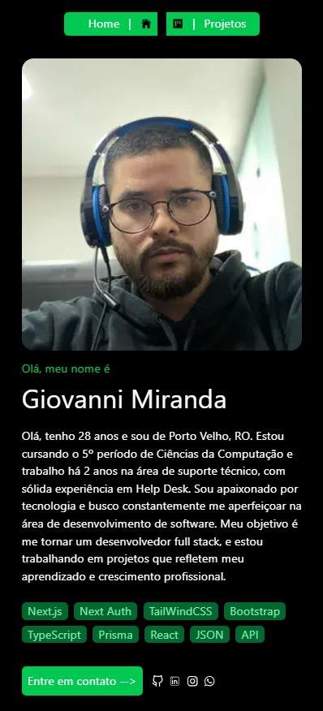

### Projeto atualizado

### Imagens do Projeto!

* Mobile


### Configuração de domínio (SEO)

Defina a URL base do site para metadados, sitemap e robots:

1. Crie um arquivo `.env.local` na raiz com:

	```
	NEXT_PUBLIC_SITE_URL=https://www.giovannimiranda.com.br
	```

2. Em produção (Vercel), configure a variável de ambiente `NEXT_PUBLIC_SITE_URL` no projeto.

Sem essa variável, o projeto usa por padrão `https://www.giovannimiranda.com.br`.